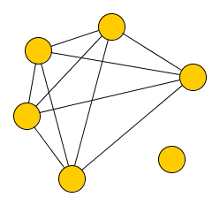
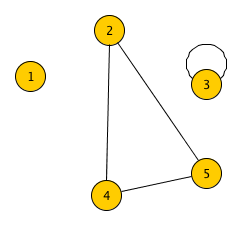
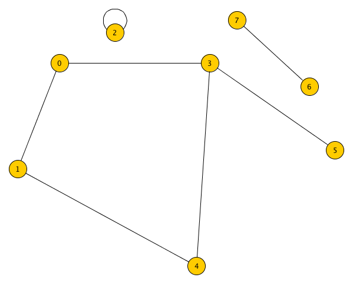
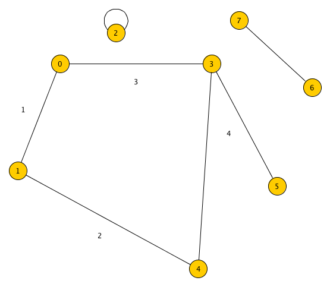
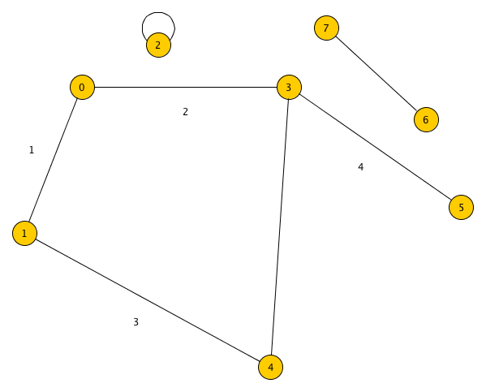

#Grafer
<small>Viktor Kronvall - 920225-5478 CDATE</small>
##Rita en oriktad graf med 6 hörn, 10 kanter och 2 sammanhängande komponenter. 


###Går det att rita en graf med 5 hörn, 4 kanter och 3 komponenter?
Ja:



##Låt G vara en oriktad graf som består av 8 hörn numrerade från 0 till 7 och kantmängden {(0,1), (0,3), (1,4), (2,2), (3,4), (3,5), (6,7)}.
###Rita G


###Ange ordningen som hörnen besöks vid en djupetförstsökning (DFS) med start i hörn 0.


###Ange ordningen som hörnen besöks vid en breddenförstsökning (BFS) med start i hörn 0.


##Skulle du representera en graf med hjälp av en närhetsmatris eller med hjälp av närhetslistor i följande fall?
###Grafen har 1000 hörn och 2000 kanter och det är viktigt att vara sparsam med minnet.

För en närhetsmatris kan varje koppling beskrivas i en 2-dimensionell matris där varje kant beskrivs av en boolean sådan att 1 motsvarar att en kant finns och 0 att en kant inte finns.

Eftersom grafen innehåller 1000 hörn behövs ett tal med stöd för minst 1000 olika kombinationer för att kunna beskriva varje hörn. Därför väljer vi att ett index beskrivs av en datatyp med 10 bitar (stöd för 1024 olika tal). Vi kallar denna packeterade int för p_int. Utvöver detta behöver varje närhetslista en längd i headern för att beskriva hur många element som finns i närhets listan. En närhetslista kan alltså beskrivas av 1+n p_int:ar vilket motsvarar (10 + n*10) bitar där n är antal kanter från detta hörn.

* Närhetsmatris (minne): `1000*1000 bitar = 1 000 000 bitar`
* Närhetslistor (minne): `1000*10 + 2000 * 10 = 30 000 bitar`

**Närhetslistor är att föredra minnesmässigt.**

För att göra detta sökbart behövs dessutom ett index som enkelt kan implementeras som en key-value mellan en p_int för index och en typ med stöd för n+k värden (`= 3000 < 2^12`) för var i minnet listan befinner sig. Om detta antas behövs det i detta fall ytterligare `n*10 + n*12 bitar = 22 000 bitar.`

Inklusive index behövs alltså endast 52 000 bitar för att beskriva denna data.

###Grafen har 1000 hörn och 50000 kanter och det är viktigt att vara sparsam med minnet.

* Närhetsmatris (minne): `1000*1000 bitar = 1 000 000 bitar`
* Närhetslistor (minne): `1000*10 + 50000*10 = 510 000 bitar`

**Närhetslistor är att föredra minnesmässigt.**

Index skulle i detta fall kräva ett tal med 51000 värden (51000 < 2^16). Så indexet skulle ta `1000*10 + 1000*16 bitar =  26 000 bitar`. Med detta index inräknat skulle datastrukturen kräva totalt `510 000 + 26 000 bitar = 536 000 bitar` vilket även det är avesvärt mycket mindre data (%54 eller lite drygt hälften) än med en närhetsmatris. 

###Det är viktigt att snabbt (på konstant tid) kunna avgöra om två hörn är grannar. Om möjligt vill du också vara sparsam med minnet.

En närhetsmatris är att föredra eftersom det blir konstant tid att hitta om två hörn är grannar. (Endast en simpel lookup - uträkning av index och titta på rätt bit).

##Förklara varför DFS tar Θ(n<sup>2</sup>) tid för en sammanhängande graf med n hörn om grafen representeras med en närhetsmatris.

Antag att vi har matrisen M och vi vill söka alla DFS med start i 0. 
För att hitta alla grannar till 0 behöver vi gå igenom första kolumnen i matrisen: Detta tar Θ(n). Vi finner att 0 har en kant till 4 och en till n.

```
   0 1 2 3 4 5 6 ... n
  --------------------
0 |0
1 |0
2 |0
3 |0
4 |1
5 |0
6 |0
. |
. |
. |
n |1
```

I detta steg tittar vi på vilka som är grannar till 4 och n. Detta är för vardera en beräkning med tidskomplexitet Θ(n). Genom att sedan se vilka kanter dessa två har så fortsätter vi längs obesökta vägar tills vi har gått igenom alla kolumner (eftersom grafen är sammanhängande).

```text
   0 1 2 3 4 5 6 ... n
  --------------------
0 |0 x x x 1 x x     1
1 |0 x x x 0 x x     0
2 |0 x x x 1 x x     1
3 |0 x x x 0 x x     1
4 |1 x x x 0 x x     0
5 |0 x x x 0 x x     0
6 |0 x x x 1 x x     1
. | 
. |
. | 
n |1 x x x 1 x x     0
```

Varje kolumn tar Θ(n) i tid och vi går igenom n kolumner => Θ(n<sup>2</sup>) i tidskomplexitet. 